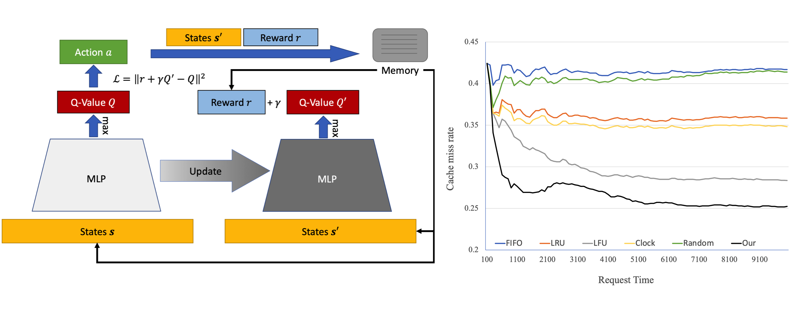

# Deep Reinforcement Learning-Based Cache Replacement Policy

## Introduction

We adopt a learning-based method to cache replacement strategy, aiming to improve the miss rate of existing traditional cache replacement policies. The main idea of modeling is to regard the strategy as a MDP so that we can employ DRL to learn how to make decision. We refer to Zhong et al. and design a similar MDP model. The learning backbone, however, is value-based DQN. Our main effort is to use short-term reward to optimize the long term miss rate, and further adopt the network content caching system to file system, testing the DRL agent with real-time disk activities.

In this work, in addition to the implementation code, we also prepared a piece of [slides](https://peihaowang.github.io/archive/Wang_DRL_Cache_2020_slides.pdf) and detailed [report](https://peihaowang.github.io/archive/Wang_DRL_Cache_2020_report.pdf).



## Code

### Dependency

To run the code for experiment, you should have the following dependencies package installed at least. We have tested and run through our code with Python 3.6 on MacOSX and Ubuntu 16.04.

```
numpy
scipy
pandas
tensorflow1.0
```

### Implementation

The modules are categorized into directory `agents` and `cache`. The `agents` folder contains our implementation of DRL agent and reflex agents, while the `cache` folder contains a cache simulator and its affiliated data loader.

* `CacheAgent.py` contains a series of base classes of cache replacement agents.

* `ReflexAgent.py` contains our implementation of cache agents of hand-crafted replacement policy, e.g. LRU, Random, etc.

* `DQNAgent.py` contains class `DQNAgent`, a cache agent with DRL-based replacement strategy. `DQNAgent` is based on Deep Q-Network and we employ `tensorflow` to build the MLPs.

* `Cache.py` contains a simulated cache system, acting as the environment for every agent. It not only maintains cache states, but also receives actions from agents and gives feedbacks. Hence, it accepts multiple set of parameters not only to setup the cache system itself, but also to specify the observation features and reward functions.

* `DataLoader.py` contains two subclasses `DataLoaderPintos` and `DataLoaderZipf`.

    * `DataLoaderPintos` can load data from our collected or synthetic dataset saved in `.csv` format. Refer to our dataset for details
    * `DataLoaderZipf` can generate access records by mimicking disk activities using Zipf distribution.

We also provide a utility `gen_zipf.py` under `utils` to help generate simulated requests following Zipf distribution, as a supplement to `DataLoaderZipf`.

### Experiments

We provide three scripts to recur the experimental results and one playground notebook for your futher experiments. Please follow the instructions below for your own purpose. Note that be cautious about the hyperparameters as they significantly affect the results.

* Before you can run the code, please prepare the data and set the correct path in the involved source files. Note that you may encounter the error that the synthetic Zipf records are missing, which means you should generate them on your own. Nevertheless, you may find the utility we mentioned above helpful.

* To reproduce "Miss Rate vs. Cache Size", i.e., Figure 3 of Experiment 1, please run `run_miss_rate_vs_capacity.py`. You may need to fine-tune hyperparameters.

* To reproduce "Miss Rate vs. Time", i.e., Figure 4 of Experiment 1, please run `run_miss_rate_vs_time.py`. You may also need to fine-tune hyperparameters.

* To reproduce the performance on real-time Pintos file system, i.e., Table 1 or Experiment 2, please run `run_pintos_filesys.py`. Beforehand you need to download our disk activity dataset.

* We also provide code for other experiments in our code. You can refer to `playground.ipynb` for feature engineering and making ablation study on reward functions. Here, You can also implement your own learning and decision procedure.

## Dataset

The real-time data were collected via [Pintos](https://web.stanford.edu/class/cs140/projects/pintos/pintos_1.html) system. We inserted a piece of tracking code into the kernel and collect disk activities while running the systems in real-time. The dataset will be released soon.

## Acknowledgment

The code for DQN was adapted from [Morvan Zhou's tutorials](https://github.com/MorvanZhou/Reinforcement-learning-with-tensorflow).

I sincerely appreciate the great efforts by the two co-workers below. We three equally contribute to this project.

1. [Yuehao Wang](https://github.com/yuehaowang)
2. [Rui Wang](https://github.com/RioReal)

Although we proposed this topic as an open question for CS181 final course project, we took it as serious scientific research in the intersected area of artificial intelligence and computer systems.
